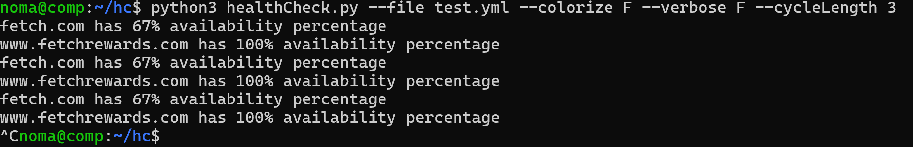
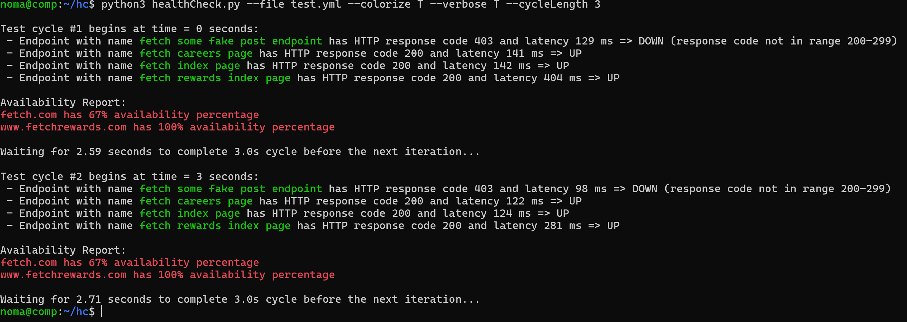

# HTTP Endpoint Health Checker

A Python script to perform health checks on HTTP endpoints defined in a YAML file. It provides availability reports, supports parallel requests, and customizable settings.

## Features

- Supports HTTP methods like GET, POST, PUT, etc.
- Parallel execution using multithreading.
- Customizable health check cycle length.
- Colorized output for better readability.
- Verbose logging for detailed insights.
- YAML-based configuration for endpoint definitions.


## Requirements

- Python Version: 3.10.12 or higher
- Libraries: 
  - yaml: For reading YAML configuration files.
  - requests: For making HTTP requests.

Install the required libraries using:
```shell
pip install requests pyyaml
```

OR 

```shell
pip install -r requirements.txt
```


## Usage

Run the program using the following command:

```shell
python healthCheck.py -f <path_to_yaml_file> [-t <threads>] [-cy <cycle_length>] [-c <colorize_output>] [-v <verbose>] 
```

Arguments:

- -f, --file          : Path to the YAML file containing endpoint definitions (Required).
- -t, --threads       : Maximum number of threads for parallel HTTP requests (Optional, Default: 10).
- -cy, --cycleLength  : Time in seconds to wait before running the next health check cycle (Optional, Default: 15).
- -c, --colorize      : Enable or disable colorized output (Optional, Default: True).
- -v, --verbose       : Enable or disable verbose logging (Optional, Default: False).

The program can be safely stopped using Ctrl + C.


## Example

```console
python healthCheck.py -f endpoints.yaml -cy 15 -c true -v true -t 5
```

- endpoints.yaml: A YAML file containing endpoint definitions.
- Cycle Length: 15 seconds between health checks.
- Colorized Output: Enabled.
- Verbose Logging: Enabled for detailed logs.
- Threads: Uses 5 threads for parallel requests.


## Example endpoints.yaml

```yaml
- name: Google Homepage
  url: https://www.google.com
  method: GET

- name: Example API
  url: https://api.example.com/data
  method: POST
  headers:
    Authorization: Bearer your_api_token
  body: '{"key": "value"}'
```


## How It Works

1. Input:
   - Reads a YAML file containing endpoint definitions.
   - The file must define the endpoint name, url, HTTP method, optional headers, and optional body.

2. Execution:
   - Health checks are performed in cycles.
   - HTTP requests are executed in parallel using the specified number of threads.

3. Output:
   - For each endpoint, the program reports:
     - HTTP response status codes.
     - Latency (in milliseconds).
     - Whether the endpoint is "UP" or "DOWN".
   - A summary of availability percentages is shown after each cycle.

4. Termination:
   - Press Ctrl + C to stop the program gracefully.


## Output

Example Output

### Verbose and Color Mode OFF:



### Verbose and Color Mode ON:



## Error Handling

- Network Errors:
  - Handles timeouts, unreachable servers, and other HTTP errors.

- Verbose Mode:
  - Logs detailed error messages for debugging.

- Program Termination:
  - The program can be safely stopped using Ctrl + C.


## Basic Structure and Flow of the Code

The healthCheck.py script is designed with modular functions and a clear execution flow. Below is the program's structure:


1. Execution Flow:
   - Parse Command-Line Arguments.
   - Load Endpoints from YAML.
   - Run Health Checks in parallel.
   - Repeat Health Checks in cycles until user terminates program.

2. Functions:
   - parseArgs: Parses and validates command-line arguments.
   - parseFileEndpoints: Reads endpoint definitions from the provided YAML file.
   - printResults: Outputs the availability percentage for each domain after a health check cycle.
   - checkEndPoint: Makes a single HTTP request to an endpoint.
   - runHealthChecks: Orchestrates the health check process.
  
